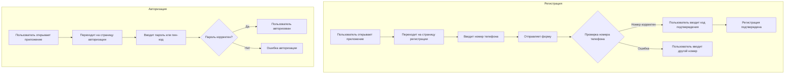
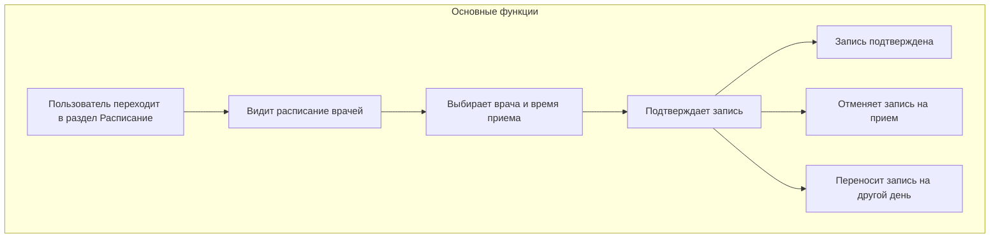

---
tags:
  - Software
  - System
  - CRM
  - Desktop
  - Mobile
Год: 2024
Релиз: 
Описание проекта: Клиентское и административное приложение для медицинских клиник
Ссылка: https://www.figma.com/design/YbUYgjHSbdNDqSPotkTkY4/Ambersoft-%2F-Medical-Clinic-App?node-id=34-5255&t=XYx5L8Yk2IpRVfhx-1
---

# Цифровая регистратура

## Анализ потребностей клиентов

### Основные потребности пациентов:
  - удобная запись на приём;
  - доступ к медицинской карте;
  - напоминания о визитах и рекомендациях;
  - возможность связи с врачом через чат или видеоконсультации.

### Ключевые функции приложения:
  - запись на приём;
  - доступ к медицинской информации;
  - напоминания;
  - телемедицина;
  - система обратной связи.

## Юзкейсы

### Registration & Auth

### Calendar

