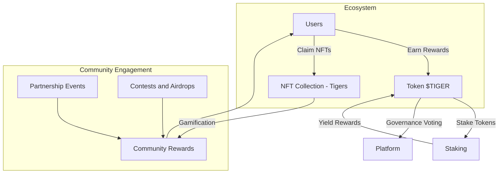
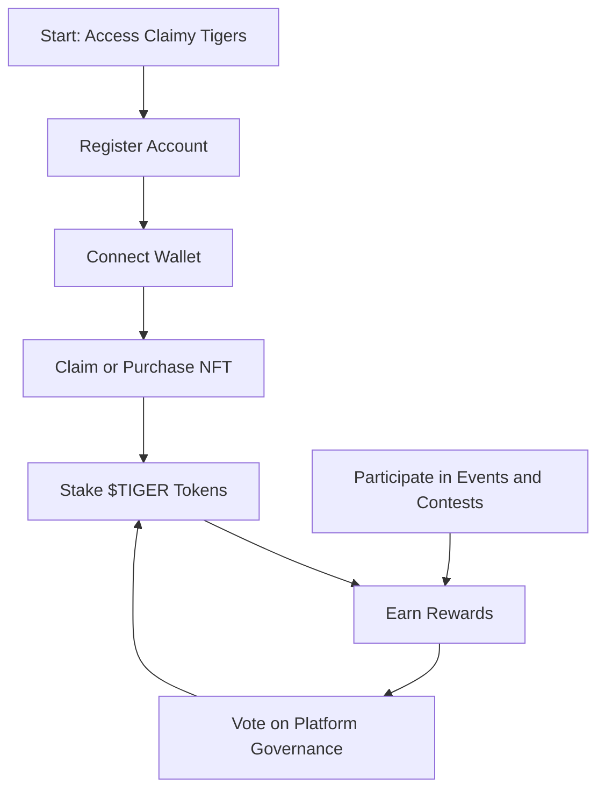
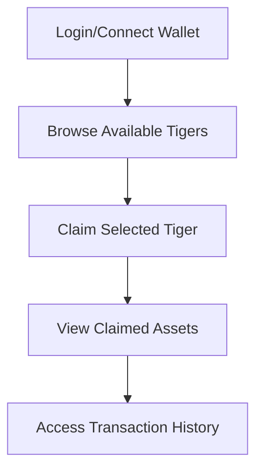

---
tags:
  - Telegram
  - Game
  - Crypto
  - Desktop
  - Mobile
Год: 2024
Релиз: true
Описание: TWA Mobile Game on TON
Подробнее: https://www.figma.com/design/mZq6FqGmvr4eLyLuvayZQ5/TON-Tigers?node-id=18-24946&t=IY18WkJRgIhIybLf-1
---

# Claimy
Release; https://tontiger.io/

## Краткое описание
"Claimy" — это игра, разработанная для платформы Telegram, созданная командой TON Tigers. Игра сочетает элементы стратегии и коллекционирования, позволяя пользователям зарабатывать токены и взаимодействовать с другими игроками в реальном времени.

## Цели проекта
- Разработать увлекательный и интуитивно понятный интерфейс для пользователей разных возрастов и уровней подготовки.
- Создать механики вовлечения, способствующие активному взаимодействию между игроками.
- Поддерживать и развивать сообщество пользователей в контексте блокчейн-технологий.

## Задачи
1. **Исследование пользователей**: Провел исследования целевой аудитории, выявив основные потребности и предпочтения игроков.
2. **Создание прототипов**: Проектировал низко- и высокофидельные прототипы, основываясь на собранных данных. Включал основные игровые механики и пользовательские сценарии.
3. **Тестирование интерфейсов**: Организовал/организовала тестирование прототипов с пользователями, анализируя их поведенческие данные и вводя изменения для улучшения юзабилити.
4. **Редизайн UI**: Разработал/разработала элементы интерфейса, включая навигацию, кнопки и графику, обеспечивая единый стиль и удобство использования.

## Релиз
- Улучшение пользовательского опыта, что привело к увеличению вовлеченности пользователей и положительным отзывам о дизайне.
- Участие в создании новых фич игры, способствующие долгосрочному удержанию пользователей.

## UX

### Claimy Flow

### Core Actions

## UI

### Wireframes

### UI

1. **Login/Connect Wallet** – Users authenticate and connect their TON wallet.
2. **Browse & Claim NFTs** – Users browse available Tigers and initiate the claim.
3. **View Claimed Assets** – Claimed Tigers display in the asset view.
4. **Transaction History** – Users access past transactions to track claims.

### Project page

