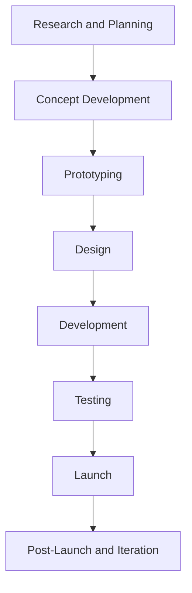
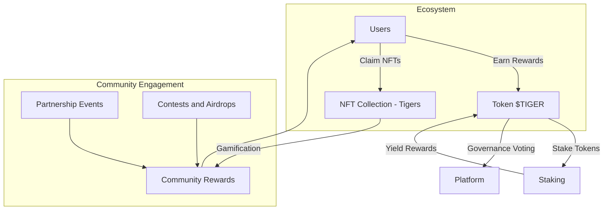
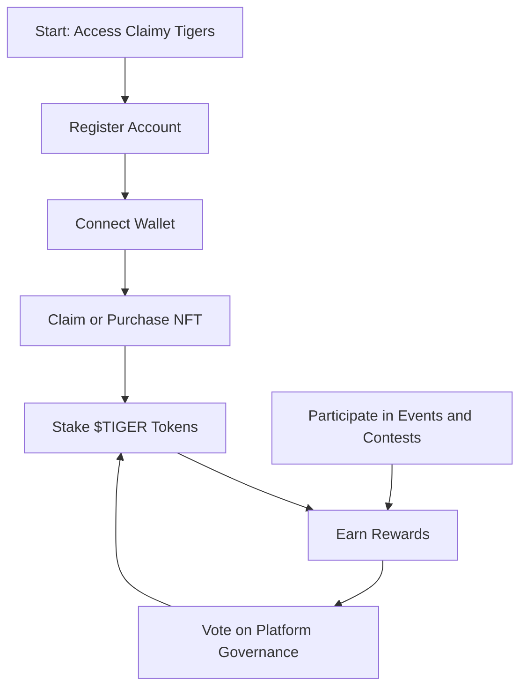
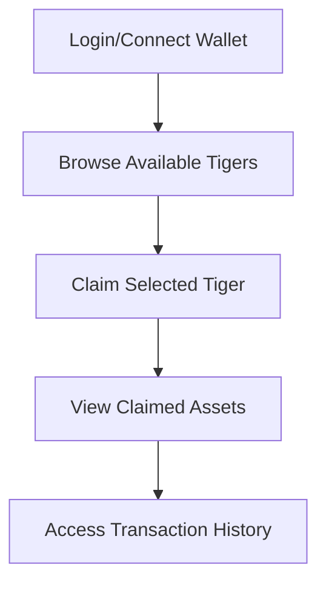

---
tags:
  - Telegram
  - Game
  - Crypto
  - Desktop
  - Mobile
Год: 2024
Релиз: true
Описание: TWA Mobile Game on TON
Подробнее: https://www.figma.com/design/mZq6FqGmvr4eLyLuvayZQ5/TON-Tigers?node-id=18-24946&t=IY18WkJRgIhIybLf-1
---

# Claimy

[Страница проекта](https://tontiger.io) |
[Сообщество](https://t.me/tontiger_tg) |
[Приложение](https://t.me/Claimybot)

## Краткое описание
"Claimy" — это P2E игра на платформе Telegram. Игра сочетает элементы стратегии и коллекционирования, позволяя пользователям майнить токены $Tigers.

## Цели
- Разработать интерфейс P2E игры, ориентированный на пользователя, вовлеченность и удовлетворенность пользователей напрямую влияют на успех проекта.
- Создать механики вовлечения, способствующие активному взаимодействию между игроками.
- Поддерживать и развивать сообщество пользователей в контексте блокчейн-технологий.

## Процесс 

### Этапы
1. **Исследование и Планирование**
- Анализ рынка
- Исследование пользователей
- Определение концепции P2E и функций
2. **Разработка Концепции**
- Мозговой штурм механики игры и визуала
- Сюжетное наполнение и персонажи
3. **Прототипирование**
- Создание каркасов UI и графики
- Разработка прототипа
- Сессии обратной связи от оунеров для уточнения идей
4. **Проектирование**
- Финализация UI на основе отзывов
- Создание графических ресурсов (NFT, фоны, элементы)
- UX-копирайтинг
5. **Разработка**
- Интеграция в TON
- Бэк/фронт приложения
- Смарт-контракты
6. **Тестирование**
- Альфа-тестирование
- Бета-тестирование с выбранными пользователями
- Фикс на основе отзывов
7. **Запуск**
- Официальный релиз игры на платформе Telegram
- Маркетинговая кампания для привлечения игроков и коллекционеров NFT
- Взаимодействие с сообществом и поддержка в ТГ канале
8. **Сопровождение и Итерация**
- Мониторинг производительности и отзывов пользователей
- Реализы обновлений на основе запросов сообщества и роадмапу
- Добавление новых NFT и тем

## UX

### Персона

| **Атрибут**            | **Описание**                                      |
|------------------------|---------------------------------------------------|
| **Имя**                | Алексей Петров                                   |
| **Возраст**            | 28 лет                                           |
| **Пол**                | Мужской                                          |
| **Образование**        | Высшее, специализация в области информационных технологий |
| **Работа**             | Программист в IT-компании                        |
| **Опыт в играх**       | Игрок с 10-летним стажем, увлекается P2E играми и NFT |
| **Технологическая грамотность** | Высокая; активно использует блокчейн и криптовалюты |
| **Цели**               | - Заработать на играх, используя свои навыки - Получить уникальные NFT и улучшения для персонажей - Взаимодействовать с сообществом игроков |
| **Боли**               | - Высокая конкуренция в P2E играх - Необходимость постоянно изучать новые механики и изменения в играх - Ограниченные возможности заработка в бесплатных играх |
| **Интересы**          | - Игры (особенно P2E и NFT) - Технологии блокчейна - Инвестиции в криптовалюты и цифровые активы |
| **Используемые платформы** | Telegram, Discord, игровые платформы, NFT-маркеты |
| **Как Claimy Tigers может помочь?** | - Предоставить увлекательный и прибыльный игровой процесс - Предложить уникальные NFT, которые можно зарабатывать и использовать в игре - Создать активное сообщество для общения и обмена опытом |

### Механика

### Core Actions

## UI

### Wireframes

### UI

1. **Login/Connect Wallet** – Users authenticate and connect their TON wallet.
2. **Browse & Claim NFTs** – Users browse available Tigers and initiate the claim.
3. **View Claimed Assets** – Claimed Tigers display in the asset view.
4. **Transaction History** – Users access past transactions to track claims.

### Project page

