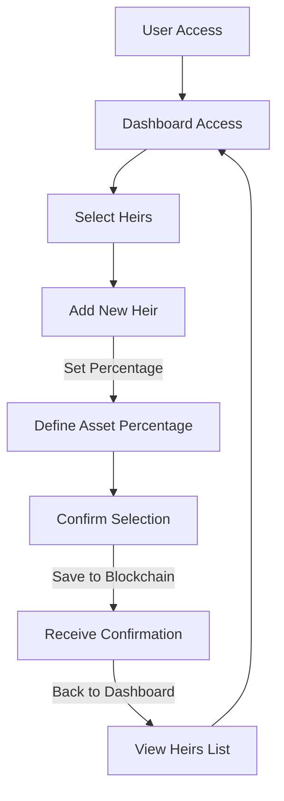
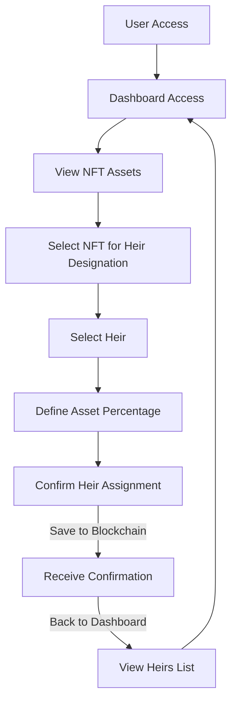
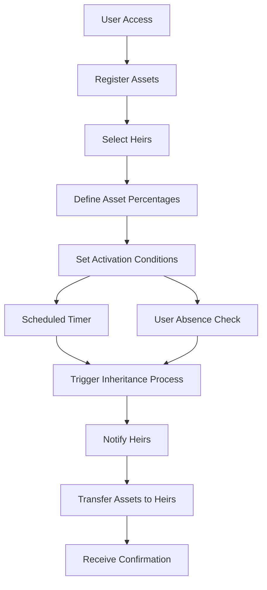
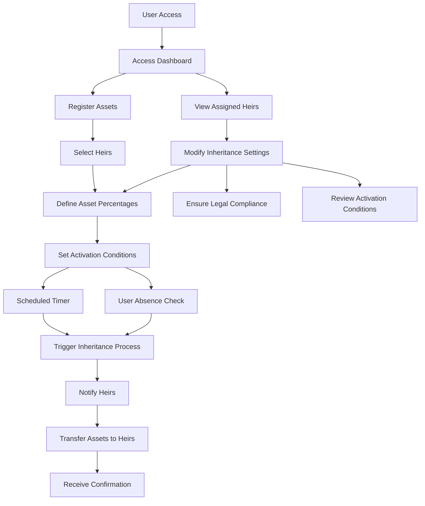

---
tags:
- Fintech
- dApp
- Software
- Blockchain
- Desktop
- Mobile
Год: 2024
Релиз: true
Описание: Платформа для защиты и управления наследованием цифровых активов
Ссылка: https://www.figma.com/design/larczXzN5oQlcRHiUXW2LZ/Kanoe-SRS?node-id=0-1&t=ZzOPfjwijHCqvjCK-1
---

# Kanoe Wallet dApp
Релиз: https://kanoewallet.com/

## Описание
 
**Kanoe Wallet** — это платформа для управления и наследования цифровых активов, созданная нашей аутсорс командой в **Эмбер**. Приложение предоставляет пользователям возможность защищать свои цифровые активы, планировать их наследование и управлять ими в одной экосистеме. Главная цель продукта — запустить на рынок интуитивно понятный и безопасный инструмент для управления токенами криптовалют и NFT.

 

---

## Задачи

1. **Анализ**
   - Конкурентный анализ, Персона, CustDev, Брейншторм.
   - UserStory, CJM, Структура и фичи.

2. **Прототипирование**
   - Карта функционала, UserFLow, Экраны.
   - Wireframes, Прототипы, Интерактив, UX-копирайтинг.

3. **Проектирование**
   - Анализ рефов, сборка UI экранов, Структура и стили.
   - Анализ токенов (states/components/variables), генерация Design System.
   - Настройка интерактива Figma, Кликабельный прототип, Микро-анимации.
   - Презентация заказчику через Figma-линк.

4. **Тестирование**
   - А/B тесты для фич, Сценарии.
   - Оценка стейками, Коридорное тестирование.
   - Фикс на основе обратной связи.

5. **Релиз**
   - Публикация лендинга, Публикация dApp.
   - Сопровождение контентом Social Media.
   - Первая лидогенерация, Мониторинг.
   - Фикс/обновление на основе активности.

## UX

### Персона

| Поле                     | Описание                                                       |
|--------------------------|----------------------------------------------------------------|
| **Имя**                  | Pavel Popov                                                |
| **Возраст**              | 45 лет                                                        |
| **Пол**                  | Мужской                                                       |
| **Профессия**            | Предприниматель, инвестор в криптовалюту                      |
| **Образование**          | Высшее (экономика и финансы)                                  |
| **Технологическая грамотность** | Высокая (опыт в криптовалютных инвестициях)             |
| **Цели использования**   | - Обеспечение сохранности активов - Передача криптовалюты наследникам |
| **Болевые точки**        | - Сложность доступа к активам для семьи - Отсутствие единых стандартов наследования криптовалют |
| **Привычки**             | - Постоянный мониторинг цифровых активов - Регулярные консультации с финансовыми и юридическими экспертами |
| **Потребности**          | - Надежный план наследования - Минимизация рисков потери доступа к активам |
| **Предпочтения**         | - Интеграция с существующим криптокошельком - Поддержка различных валют (BTC, ETH и stablecoins) |
| **Ценности**             | - Конфиденциальность - Уверенность в будущем семьи - Простота и безопасность процесса наследования |

## UI

## Релиз

- **Запуск и активные пользователей:** За первый месяц после запуска количество ежедневных активных пользователей увеличилось на 25%.
- **Положительная обратная связь:** Стейкхолдеры отметили удобство интерфейса и интересный контент.
- **Положительный рейтинг:** Приложение получило высокие оценки и положительные отзывы.

## Инструменты

- **Figma**
- **Miro**
- **Webflow** (HTML / CSS / JS)

---
