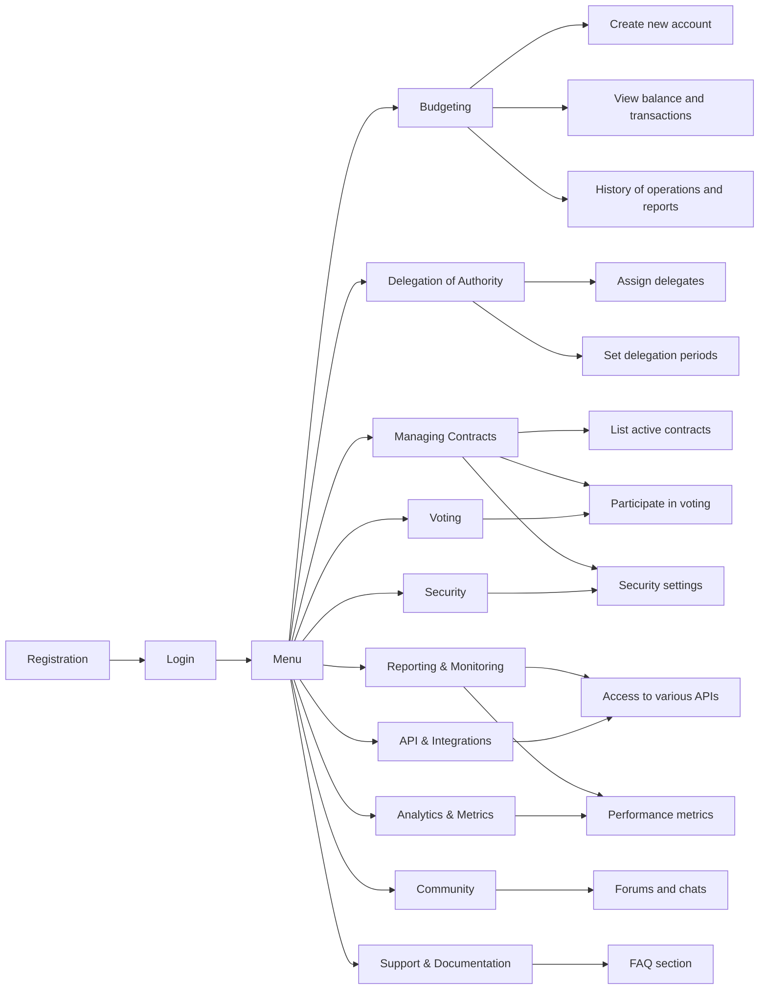

---
tags:
- DAO
- dApp
- Software
- Blockchain
- Desktop
- Mobile
Год: 2024
Релиз: true
Описание: Платформа создания и управление DAO
Ссылка: https://www.figma.com/design/R9ceAELlyO5wcHKliHjsJi/MirrorDAO?node-id=0-1&t=04iPDPk98aHil4FF-1
---

Product Release: https://mirrordao.com/

# User Flow

# Mind Map

```mermaid
graph TB
    A("MirrorDAO") --> B(BUDGETING)
    B --> C(CREATE BUDGET)
    C --> D(Create and approve budgets)
    C --> E(PLAN BUDGET)
    E --> F(Add articles of expense)
    C --> G(APPROVE BUDGET)
    G --> H(Vote on budget proposal)
    C --> I(FOLLOW UP)
    I --> J(Track execution of approved budget)

    A --> K(GOVERNANCE)
    K --> L(GOVERNANCE SYSTEM)
    L --> M(Manage decision making process)
    L --> N(TOKEN STRUCTURE)
    N --> O(Define multiple levels of tokens with specific roles and permissions)
    L --> P(VOTING MECHANISMS)
    P --> Q(Implement voting mechanisms based on token ownership)

    A --> R(INTELLECTUAL PROPERTY)
    R --> S(REGISTRY)
    S --> T(Register and store proof of intellectual property ownership)
    S --> U(DOCUMENTATION)
    U --> V(Store documents, codes, artworks, etc.)
    S --> W(ARTIFACTS)
    W --> X(Record digital artifacts linked to IP)

    A --> Y(CONTRACTS)
    Y --> Z(SMART CONTRACTS)
    Z --> AA(Set up and manage smart contracts)
    Z --> AB(CONFIGURATION)
    AB --> AC(Configure parameters and conditions for contract execution)
    Z --> AD(INTEGRATION)
    AD --> AE(Integrate with various blockchains and decentralized applications)

    A --> AF(PAYMENTS)
    AF --> AG(GENERATE INVOICE)
    AG --> AH(Create invoices for payments)
    AG --> AI(MAKE PAYMENTS)
    AI --> AJ(Process incoming and outgoing payments)
    AG --> AK(MASS PAYMENTS)
    AK --> AL(Handle bulk payments efficiently)
    AG --> AM(WEB 3 ACQUIRING)
    AM --> AN(Facilitate web 3 payments and integrations)

    A --> AO(FINANCIAL RAILS)
    AO --> AP(BRIDGES)
    AP --> AQ(Enable cross-chain asset transfers)
    AP --> AR(SWAPS)
    AR --> AS(Allow conversion between different types of currencies)
    AP --> AT(SWIFT/SEPA)
    AT --> AU(Integrate with traditional financial networks)

    A --> AV(CRYPTO ACCOUNTING)
    AV --> AW(TRANSACTION HISTORY)
    AW --> AX(Track all transactions across connected wallets)
    AW --> AY(EXCHANGE INTEGRATION)
    AY --> AZ(Sync with major cryptocurrency exchanges)
    AW --> BA(WEB 2 INTEGRATION)
    BA --> BB(Convert and track fiat currency transactions)
    AW --> BC(ERP INTEGRATION)
    BC --> BD(Connect with Enterprise Resource Planning systems)
    AW --> BE(DEFI INTEGRATION)
    BE --> BF(Interface with Decentralized Finance platforms)

    A --> BG(TAXATION)
    BG --> BH(TAX SCENARIOS)
    BH --> BI(Manage tax obligations related to cryptocurrency operations)
    BH --> BJ(COMPLIANCE)
    BJ --> BK(Ensure regulatory compliance across jurisdictions)

    A --> BL(HR ADMINISTRATION)
    BL --> BM(HIRE EMPLOYEES)
    BM --> BN(Recruit and manage team members)
    BM --> BO(PROFILE MANAGEMENT)
    BO --> BP(Create and maintain employee profiles)
    BM --> BQ(TIME TRACKING)
    BQ --> BR(Monitor work hours and productivity)
    BM --> BS(PAYROLL)
    BS --> BT(Calculate and process salaries and bonuses)
    BM --> BU(IDENTITY MANAGEMENT)
    BU --> BV(Establish and verify digital identities)

    A --> BW(OTHER)
    BW --> BX(UNLISTED FUNCTIONALITIES)
    BX --> BY(Miscellaneous features not explicitly categorized above)
```

