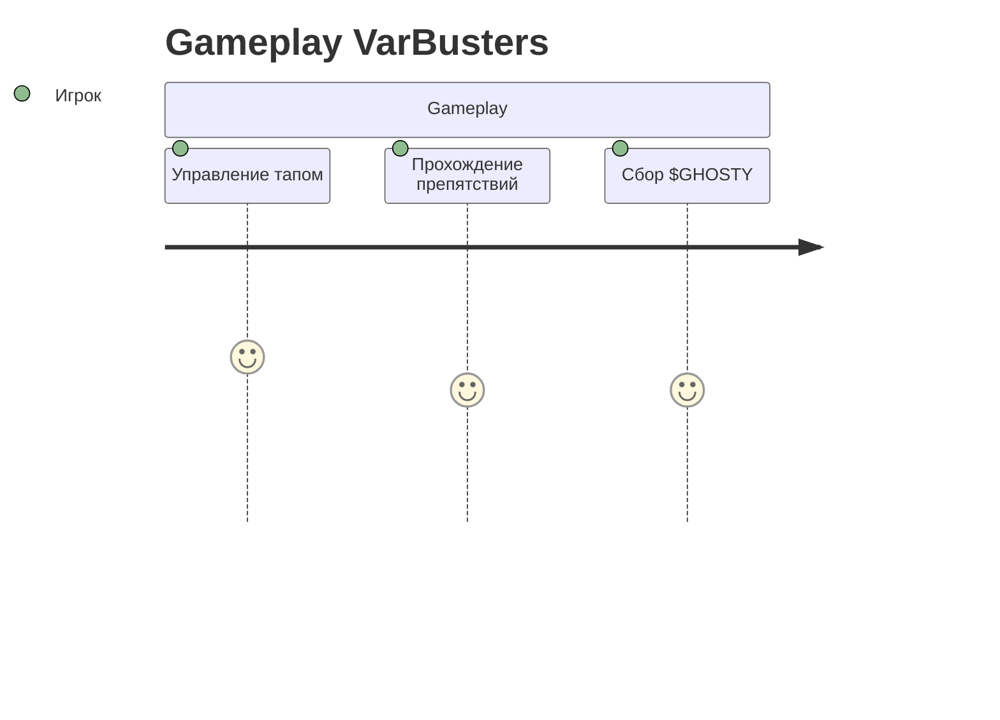
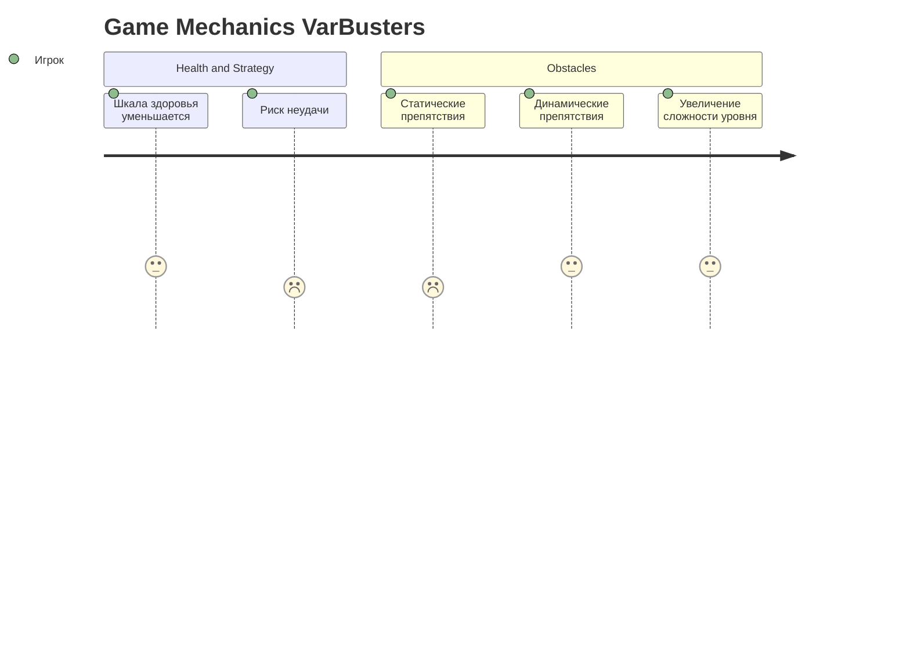
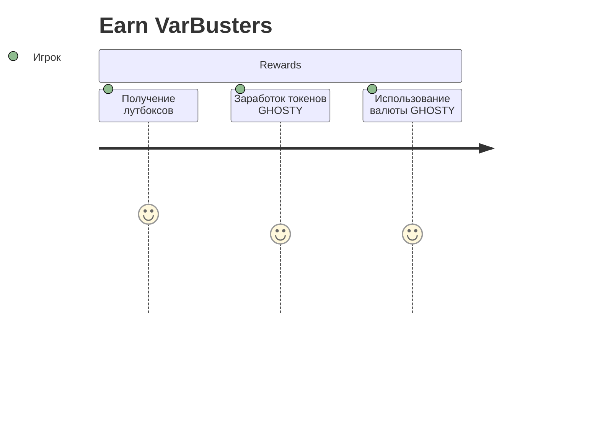
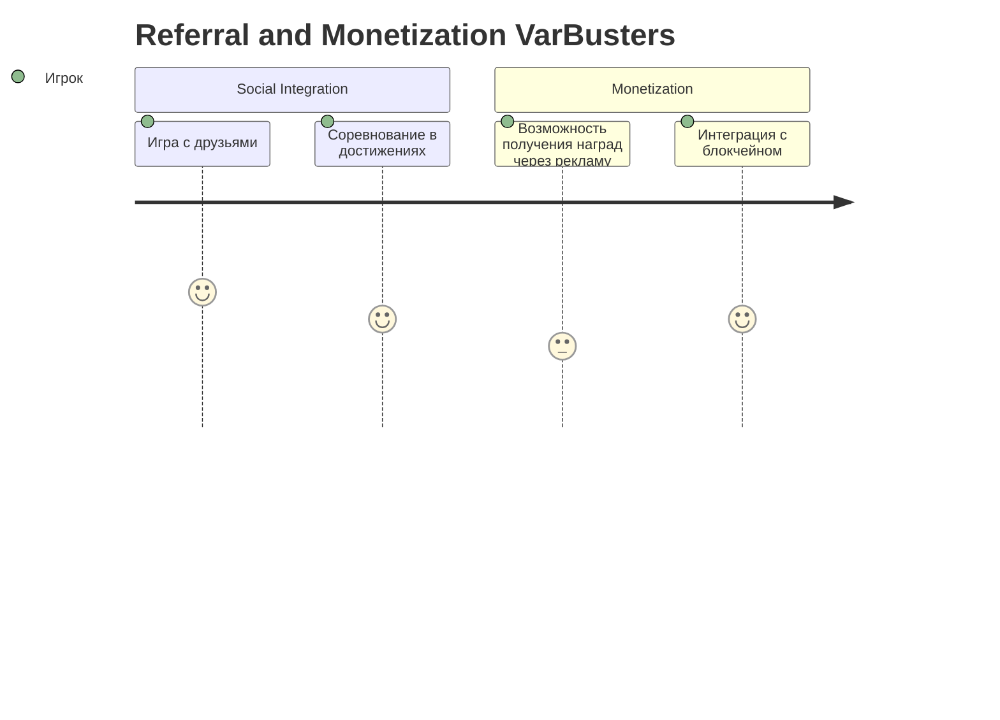

---
tags:
  - Telegram
  - Game
  - Crypto
  - Desktop
  - Mobile
Год: 2024
Релиз: true
Описание: Telegram Mini App Mobile Game
Подробнее: https://www.figma.com/design/DNg0ol4k4HDhpwu4nur3l8/Noir-Roulette-Telegram-Game-(Copy)?node-id=0-1&t=aRssaNvExBthA7tx-1
---
# Noir Roulette (WBT)

## Описание

«Noir Roulette» — это онлайн-игра, сочетающая элементы классической русской рулетки с азартными играми на блокчейне Whitechain. Игроки могут делать ставки в криптовалюте, использовать различные виды оружия и применять вспомогательные способности, чтобы повысить свои шансы на успех.
Игра предлагает уникальное сочетание азарта, риска и стратегии, погружая игроков в мрачную атмосферу нуарного мира. Интеграция с блокчейном Whitechain делает игру честной и надежной, а вспомогательные способности добавляют дополнительный слой стратегии. Мы уверены, что эта игра привлечет внимание как любителей азартных игр, так и фанатов необычных игровых механик.

### Ключевые механики

1. Ставки в криптовалюте:
   - Использование Whitechain для ставок и выигрышей.
   - Минимальные и максимальные ставки зависят от выбранного оружия.
2. Разнообразие оружия:
   - Револьвер: случайный выбор из 6 патронов с возможностью прокрутки барабана.
   - Дробовик: случайный выбор из 8 патронов с заранее определенной последовательностью.
3. Система ставок:
   - Возможность повышать и понижать ставки перед каждым ходом.
   - Ставки могут понижаться при пропуске хода или проигрыше.
4. Блокчейн-интеграция:
   - Все ставки и результаты фиксируются на блокчейне Whitechain для прозрачности и честности.
### Вспомогательные механики:

- Выброс патрона.
- Предвидение.
- Смена патрона.
- Двойной ход.
- Защитный экран.
- Замедление времени.
- Психологическая атака.
- Шанс удачи.
### ЦА

- Фанаты азартных игр.
- Блокчейн-энтузиасты.
- Фанаты острых ощущений и необычных игровых механик.

### Платформы

Telegram Mini Apps
- Desktop (Windows/MacOS/Linux).
- Mobile (iOS/Android).

### Визуальный стиль

- Нуар: темная, мрачная эстетика с акцентом на классические нуар-фильмы.
- Pixel Art, 8-bit.

## UI

![[Group 103.png]]

![[Group 104.png]]

![[Group 105.png]]

![[Group 106.png]]

![[Group 107.png]]

---
## User Journey 

### Gameplay

### Game Mechanics

### Earn

### Referral

---
